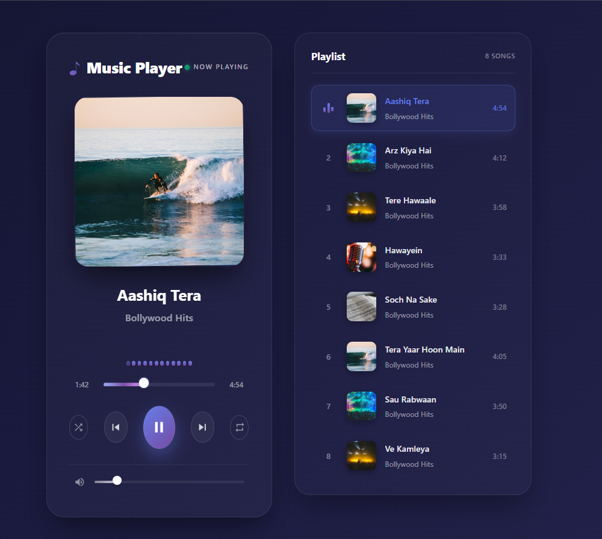

# 🎵 CodeAlpha Music Player

A modern music player web application built using **React + Vite** as part of the CodeAlpha Frontend Development Internship.

---

## 🚀 Live Demo
https://code-alpha-music-player-pearl-mu.vercel.app

---

## 📌 Features
- Play, pause, next, and previous controls  
- Dynamic playlist with multiple songs  
- Progress bar with seek functionality  
- Volume control slider  
- Displays song title and artist  
- Responsive and clean user interface  

---

## 🛠️ Tech Stack
- React (Vite)  
- JavaScript (ES6)  
- HTML5 Audio API  
- CSS3  

---

## 📸 Screenshot
  

---

🙋‍♂️ Author

Gaurav Salunke

GitHub: https://github.com/Gaurav-29-eng
LinkedIn: www.linkedin.com/in/gaurav-salunke-cse27

---

## ⚙️ How to Run Locally

```bash
# Clone the repository
git clone https://github.com/Gaurav-29-eng/CodeAlpha_MusicPlayer

# Navigate into project
cd CodeAlpha_MusicPlayer

# Install dependencies
npm install

# Run development server
npm run dev


